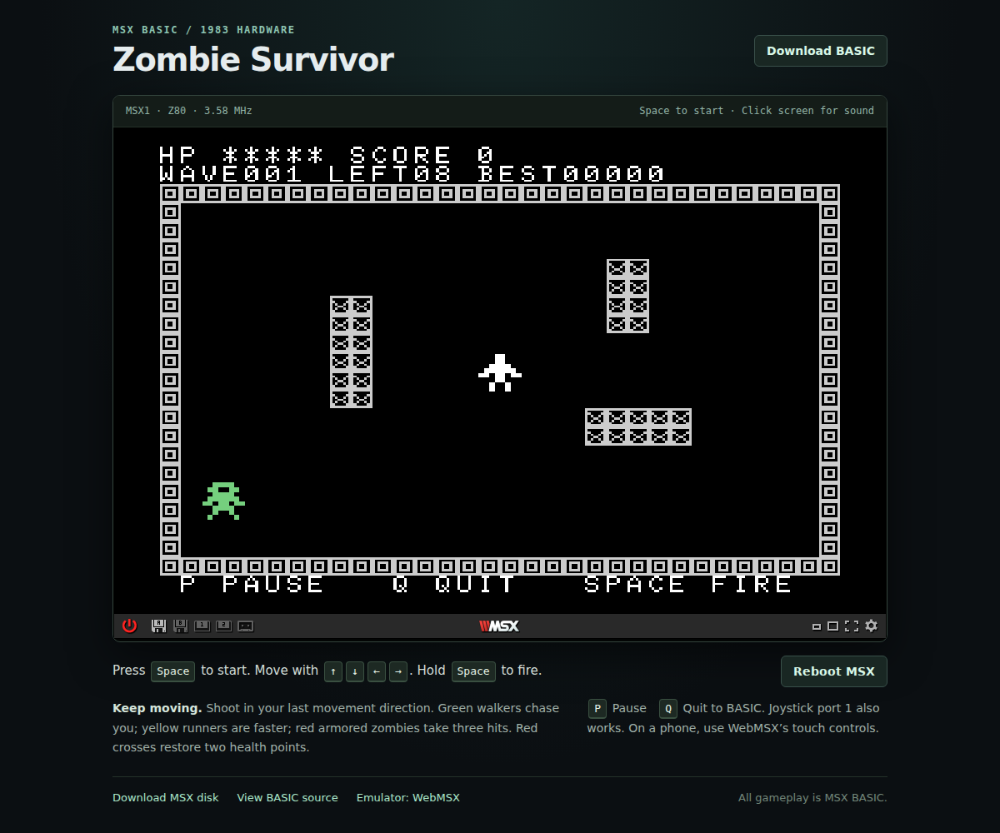

# Zombie Survivor — MSX BASIC

A complete top-down zombie shooter written in numbered **MSX BASIC 1.0**.
The website boots the same program in a WebMSX emulator. No game logic is
implemented in JavaScript and no machine-code extension is required.



## Play

[Play now in WebMSX](https://webmsx.org/?MACHINE=MSX1A&PRESETS=DISK&DISKA_URL=//cdn.jsdelivr.net/gh/Nox1381/MSX-BASIC-SCHOOTING-GAME@b59658d1ebe2d4520682b92cc3e065b9413613b5/docs/game/ZOMBIE.DSK&AUTO_POWER_ON_DELAY=0&AUTO_START=true&FAST_BOOT=1&Z80_CLOCK_MODE=8&SPEED=1000&JOYKEYS_MODE=-1&SCREEN_FULLSCREEN_MODE=0&ENVIRONMENT=83)
or [download the MSX disk image](docs/game/ZOMBIE.DSK).
Turbo mode uses an **8× CPU overclock and 1000% simulation speed**.
The BASIC loop paces play to roughly 30 updates per second when the browser
can keep up.

This link loads the pinned disk from this repository through jsDelivr into the official
WebMSX website. Wait for the title screen, click the emulator for sound,
then press Space to start.

| Control | Action |
| --- | --- |
| Arrow keys / joystick port 1 | Move in eight directions and face that direction |
| Space / joystick button A | Shoot; hold for automatic fire |
| P | Pause; Space or Fire resumes |
| Q | Quit to the MSX BASIC prompt |
| Space / Fire after game over | Restart |

You begin with five health points. Zombies enter from the edges and chase
you through a crate-filled arena. Green walkers take one hit; yellow runners
move faster; red armored zombies take three hits. Runners start in wave 2,
armored zombies in wave 3. Medkits restore two health points, up to five.
Fire uses your last movement direction, so you can shoot while standing still.
There is unlimited ammunition and at most four shots on screen.

Each cleared wave awards 50 bonus points. Kills award 10 points for walkers,
25 for runners, and 40 for armored zombies. Up to six zombies are active at
once; wave targets grow from eight kills to a maximum of thirty. The best
score survives restarts during the current session, but is not written to disk.
Scores cap at 30,000 and the displayed wave caps at 999.

## Run on an MSX machine

Requirements: MSX1 or later, standard MSX BASIC, **32 KB RAM or more**, and
16 KB VRAM. A disk interface is needed only for disk loading. No MSX2-only
graphics instructions, BASIC compiler, turbo CPU, or custom BIOS calls are used.

1. Put `game/ZOMBIE.BAS` on an MSX-readable disk, or mount
   `docs/game/ZOMBIE.DSK` in an emulator or compatible disk-image device.
2. In Disk BASIC, enter:

   ```basic
   RUN "ZOMBIE.BAS"
   ```

3. The supplied disk image also contains `AUTOEXEC.BAS`, so starting an MSX
   with the disk inserted should launch the game automatically.

If the MSX has no disk interface, the numbered listing can be entered directly
in BASIC and started with `RUN`. Once entered, `CSAVE "ZOMBIE"` saves a
tokenized cassette copy, which can later be loaded with `CLOAD` and `RUN`.
The downloadable `.BAS` is an ASCII listing; it is not itself a cassette image.

## Run the website locally

Python 3 is the only server dependency. An internet connection is required
to load WebMSX 6.0.8 from the pinned upstream release on jsDelivr.

```sh
python3 tools/serve.py
```

Open **http://127.0.0.1:8000/** in Chrome, Firefox, or another current browser.
Click the emulator screen to enable sound. Then press Space to start the game.
Use `python3 tools/serve.py --port 8080` if port 8000 is occupied.
Double-clicking `index.html` is insufficient: disk loading needs an HTTP server.

## GitHub hosting

The `docs/` directory is a complete static GitHub Pages site. There is no
backend service, database, or build step required to host it.

The repository is [Nox1381/MSX-BASIC-SCHOOTING-GAME](https://github.com/Nox1381/MSX-BASIC-SCHOOTING-GAME).
The custom launcher is ready to deploy from **main → /docs** in
**Settings → Pages → Deploy from a branch**. Pages has not yet been enabled;
the direct WebMSX link above is already playable.
Once enabled, the launcher address will be
https://nox1381.github.io/MSX-BASIC-SCHOOTING-GAME/.

To host your own fork:

1. Upload or fork this project into a public GitHub repository.
2. In **Settings → Pages**, choose **Deploy from a branch**.
3. Select the **main** branch and the **/docs** folder, then save.
4. Open the Pages address GitHub shows after deployment. The browser loads
   `game/ZOMBIE.DSK` relative to that page, so project subpaths work correctly.

Updates pushed to `main` are deployed automatically from `docs/` once Pages
is enabled. No credentials or tokens belong in this project.

## Sprite method

Every sprite consists of eight explicitly defined bytes. This exact supplied
pattern is assigned to sprite pattern 0 and used for armored zombies:

```basic
A$=CHR$(&H99)+CHR$(&H5A)+CHR$(&H7E)+CHR$(&HDB)+CHR$(&HFF)+CHR$(&H3C)+CHR$(&H42)+CHR$(&H81)
SPRITE$(0)=A$
```

`SCREEN 1,1` combines the normal 32-column character screen with magnified
8×8 sprite patterns, displayed at 16×16 pixels. `SPRITE$(n)` selects a
pattern, while `PUT SPRITE` places that pattern on a hardware sprite plane.
Patterns 1–8 are the player's eight directions, 9–10 are animated walkers,
11 is the runner, 12 is the bullet, and 13 is the medkit.

The MSX1 VDP displays only four sprites on one scanline. Enemy sprite
priority rotates every game update to spread the resulting flicker when a
crowd lines up. Software hitboxes remain active even when a hardware sprite
briefly disappears. This is a normal MSX1 limitation.

## Change or rebuild the game

Edit **`game/ZOMBIE.BAS`**, then run:

```sh
python3 tools/build.py
python3 tools/build.py --check
```

The builder checks line order, line lengths, and numeric jump targets. It
copies the source with MSX line endings to `docs/game/ZOMBIE.BAS` and creates
a reproducible 720 KiB FAT12 disk with the game's ASCII listing and auto-start
file. Its two-byte Z80 entry returns to Disk BASIC; no MSX-DOS files are needed.
After rebuilding, commit and push both the source and generated files.

| BASIC lines | Purpose |
| --- | --- |
| 10–220 | Initialization and title screen |
| 1000–1280 | Session setup and main game loop |
| 2000–2860 | Arena, waves, enemy spawning |
| 3000–3920 | Player movement, shooting, bullet hits |
| 4700–5140 | Enemy pursuit, detours, player damage |
| 5300–5730 | Medkits and sprite drawing |
| 6000–8030 | Game over, restart, pause, HUD, quit |
| 8200–8830 | Sprites and custom character tiles |
| 1300–1350 | Fast obstacle collision checks |
| 9500–9520 | Direction and tile data |

The loop waits until at least twenty emulated video ticks have elapsed between updates.
At the default 1000% simulation speed, this targets about 30 updates per second.
Actual speed depends on the browser and scene complexity. Movement and
cooldowns use game updates. The website keeps its 8× CPU overclock during
gameplay. This build is tuned for browser simulation; on original hardware
the twenty-tick wait can be reduced for better native speed.
The emulator's own menus allow different
machines or CPU speeds for experimentation.

## Project files

```text
game/ZOMBIE.BAS       Canonical original BASIC source
docs/index.html      Browser launcher
docs/app.js          Emulator configuration and loading
docs/style.css       Launcher layout
docs/game/ZOMBIE.BAS MSX-compatible ASCII download
docs/game/ZOMBIE.DSK Auto-starting 720K MSX disk image
tools/build.py       Source validator and disk builder
tools/serve.py       Local HTTP server
```

Original game and launcher code are released under the MIT license in
`LICENSE`. WebMSX and its firmware remain separate upstream dependencies
under their respective terms. This repository does not redistribute BIOS ROMs.

References: [WebMSX upstream](https://github.com/ppeccin/WebMSX),
[WebMSX launch configuration](https://github.com/ppeccin/WebMSX/blob/master/doc/README.md),
and [MSX technical handbook](https://konamiman.github.io/MSX2-Technical-Handbook/md/Chapter2.html).
